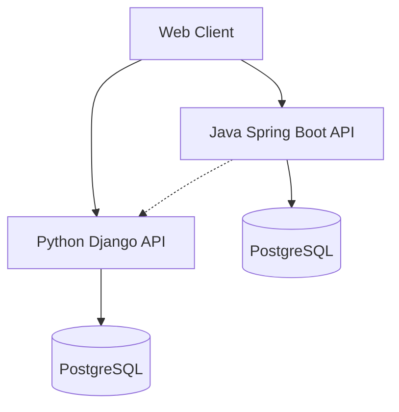

# Book Genre ML Platform

[](https://www.java.com/)
[](https://spring.io/projects/spring-boot)
[](https://www.python.org/)
[](https://www.djangoproject.com/)
[](https://www.django-rest-framework.org/)
[](https://www.postman.com/)
[](https://www.docker.com/)
[](https://www.postgresql.org/)
[](https://opensource.org/licenses/MIT)

A training project that serves as a platform for managing books and predicting their genres using machine learning. It is built with a microservices architecture, leveraging Java Spring Boot and Python Django.

## 📋 Table of Contents

- [Architecture](#-architecture)
- [Technology stack](#-technology-stack)
- [Functionality](#-functionality)
- [Installation and launch](#-installation-and-launch)
- [API](#-api)
- [License](#-license)
- [Testing the Integration](#-testing-the-integration)
- [Troubleshooting](#-troubleshooting)

## 🏗️ Architecture

The project employs a microservices architecture to ensure scalability and flexibility:

```plaintext
book-genre-platform/
├── backend-service/          # Java microservice (Spring Boot) – The main API for CRUD operations with books
├── ml-service/               # Python microservice (Django) – Microservice for ML predictions
├── infrastructure/           # Docker Compose configuration for orchestrating services
├── algorithms/               # Solving algorithmic problems using Python and Java
├── docs/                     # Additional Documentation
├── integration-test.sh       # Script for integration testing
└── README.md                 # This file
```


```mermaid
graph TD
    Client[Web Client] --> JavaAPI[Java Spring Boot API]
    Client --> PythonAPI[Python Django API]
    JavaAPI --> JavaDB[(PostgreSQL)]
    PythonAPI --> PythonDB[(PostgreSQL)]
    JavaAPI -.-> PythonAPI
```

## 🛠️ Technology stack

### Backend Service (Java)

- Java 24.0.1
- Spring Boot 3.5.5
- Spring Data JPA - for working with the database
- PostgreSQL 16.10
- Flywaydb - for version control of the database schema (migrations)
- Maven - for project build purposes

### ML Service (Python)

- Python 3.12.5
- Django 5.2.6 - web framework
- Django REST Framework (DRF) - for building a REST API
- PostgreSQL 16.10
- Pip - for dependency management

### General Tools

- Git - version control
- Docker - containerization
- Docker Compose - container orchestration
- Postman - API testing

### 📊 Functionality

### Current Functionality

- Backend Service: CRUD operations for books (create, read, update, delete) via REST API
- ML Service:  CRUD operations for books (create, read, update, delete) via REST API, search for similar books
- Interaction between microservices
- PostgreSQL is installed via Docker
- Java services (Spring Boot) and Python service (Django) are configured to work with PostgreSQL
- Integration of an ML model for book genre prediction

### Planned Functionality

- Application containerization using Docker
- CI/CD setup with GitHub Actions

## 🚀 Installation and launch

### Prerequisites

- Install Java 24.0.1 or OpenJDK 24
- Install Python 3.12.5
- Install Git
- Install Docker 4.46.0
- Install PostgreSQL 16.10

### Starting the Backend Service (Java)

```bash
cd backend-service
./mvnw spring-boot:run
```

The service will be accessible at the following address: http://localhost:8080

### Starting the ML Service (Python)

1. Go to the directory ml-service:
```bash
cd ml-service
```
2. Create a virtual environment and activate it:
```bash
python -m venv venv
source venv/bin/activate   # for Linux/macOS
# or
venv\Scripts\activate      # for Windows
```
3. Install the dependencies:
```bash
pip install -r requirements.txt
```
4. Apply the migrations:
```bash
python manage.py migrate
```
5. Start the server:
```bash
python manage.py runserver
```

The service will be accessible at the following address: http://localhost:8000

### Starting the Docker

```bash
cd infrastructure
docker-compose -f docker-compose.db.yml up -d
```

## 📡 API

### Backend Service (Java)

- GET /api/books - Get all books
- POST /api/books - Create a new book
- GET /api/books/{id} - Get book by ID
- PUT /api/books/{id} - Update book by ID
- DELETE /api/books/{id} - Delete a book by ID
- POST /api/genres/predictGenre - Get the predicted book genre
- GET /api/health/db - Check the connection to the database

Example of a request body for creating a book (JSON):
```json
{
  "title": "The title of the book",
  "author": "The author of the book",
  "publicationYear": 2023,
  "pages": 120,
  "rating": 4.1
}
```

Example of an HTTP request for genre prediction:
```bash
curl http://localhost:8080/api/genres/predictGenre?title=Python+Programming
```

### ML Service (Python)

- GET /api/books/ - Get all books
- POST /api/books/ - Create a new book
- GET /api/books/{id}/ - Get book by ID
- PUT /api/books/{id}/ - Update book by ID
- DELETE /api/books/{id}/ - Delete a book by ID
- POST /api/predict/ - Genre prediction for one book
- POST /api/predict/batch/ - Batch prediction for multiple books
- GET /api/books/similar/{book_id}/ - Get similar books
- GET /api/health/ - Checking the health of the service
- GET /api/model/info/ - Information about the uploaded ML model
- GET /api/predictions/stats/ - Prediction statistics

Example of a request body for creating a book (JSON):
```json
{
  "title": "The title of the book",
  "author": "The author of the book",
  "publication_year": 2022,
  "pages": 240,
  "rating": 4.2
}
```

## 📄 License
This project is licensed under the MIT License. For more details, please refer to the LICENSE file.

## 🧪 Testing the Integration

1. Start both services
2. Predict genre using the Python service from Java service:
```bash
POST http://localhost:8080/api/genres/predictGenre
```

## 🐛 Troubleshooting

### Port Already in Use Error

If port 8080 or 8000 is occupied, change the port in the settings:

**Java-service**: add to application.properties:
```properties
server.port=8081
```
**Python-service**: run with a different port:
```bash
python manage.py runserver 8001
```

### Database connection errors

Make sure that the database is running and accessible.

To add test data to the empty database, run load_test_data:
```bash
python manage.py load_test_data
```

Check database connections:
- Java: http://localhost:8080/api/health/db
- Python: http://localhost:8000/api/health/

Check API functionality:
- Java: http://localhost:8080/api/books
- Python: http://localhost:8000/api/books/